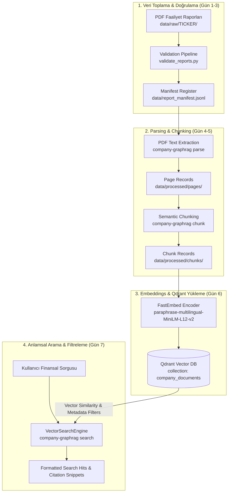
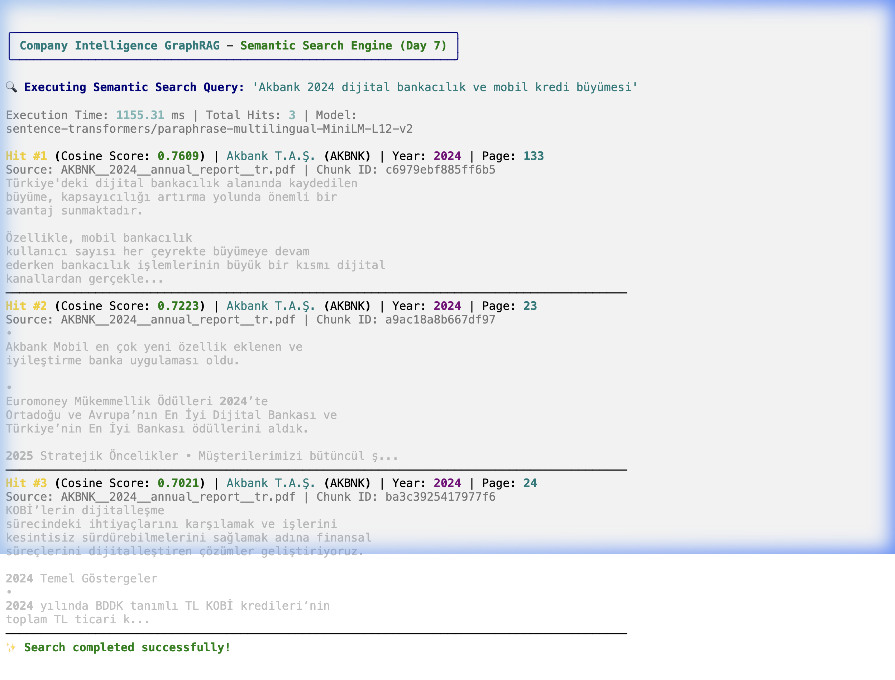
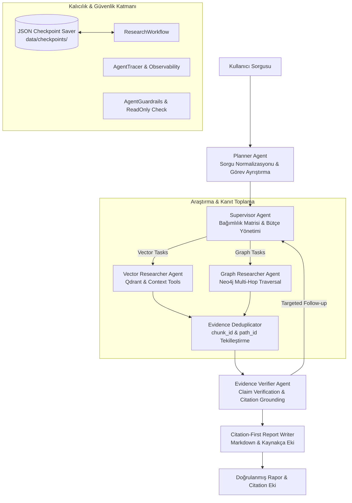

# Company Intelligence GraphRAG 🏢📊

[](https://www.python.org/downloads/release/python-3120/)
[](https://github.com/astral-sh/uv)
[](https://github.com/astral-sh/ruff)
[](http://mypy-lang.org/)
[](LICENSE)

**Company Intelligence GraphRAG**, BIST 100 şirketlerinin resmi yıllık ve entegre faaliyet raporlarını (PDF) işleyen, vektör tabanlı anlamsal arama (**Qdrant**) ile bilgi grafiği tabanlı varlık-ilişki çıkarımını (**Neo4j**) birleştiren hibrit bir GraphRAG (Retrieval-Augmented Generation) sistemidir.

---

## 🎯 Proje Amacı

Kurumsal ve finansal analizlerde yalnızca vektör araması yapmak; karmaşık ortaklık yapıları, bağlı ortaklıklar, finansal metrik ilişkileri ve çok adımlı (multi-hop) mantıksal çıkarımlar için yetersiz kalmaktadır. Projenin temel amaçları:

1. **Doğrulanmış Baseline Veri Seti:** BIST şirketlerinin resmi kaynaklarından (yatırımcı ilişkileri & KAP) toplanmış, PyMuPDF metin ve hash doğrulamasından geçmiş faaliyet raporlarını işlemek.
2. **Anlamsal Metin Bölümleme (Semantic Chunking):** Paragraf ve cümle sınırlarını koruyan token tabanlı metin bölümleme (500 token target, 50 token overlap).
3. **Vektör Veritabanı İndeksleme (Qdrant Vector DB):** Açık kaynak çok dilli embedding modelleri ile üretilen vektörleri ve 11 metadata alanını Qdrant üzerinde saklamak.
4. **Hibrit Getiri (Hybrid Retrieval):** Metin içi anlamsal arama (Vector Search) ile şirket, yönetim kurulu, iştirak ve finansal rasyo ilişkilerini barındıran Bilgi Grafiğini (Knowledge Graph) tek potada eritmek.
5. **Kaynak Gösterimli Yanıt Üretimi (Citation-Grounded Generation):** Model çıktılarını doğrudan PDF sayfa numaraları ve metin bloklarıyla ilişkilendirerek halüsinasyonu engellemek.

---

## 🔄 Veri İşleme Akışı (Data Pipeline Flow)

Sistemin uçtan uca veri işleme, indeksleme ve sorgulama akışı aşağıdaki gibidir:



---

## 📦 Vektör İndeks ve Koleksiyon Bilgileri (Qdrant)

- **Collection Adı:** `company_documents`
- **Embedding Modeli:** `sentence-transformers/paraphrase-multilingual-MiniLM-L12-v2` (FastEmbed ONNX)
- **Vektör Boyutu (Vector Dimension):** `384`
- **Mesafe Metriği (Distance Metric):** `Cosine`
- **Toplam İndekslenen Chunk Sayısı:** **25,859**
- **Point ID Formatı:** Deterministik UUIDv5 (Aynı veri yüklendiğinde çakışmasız güncelleme)
- **Payload Metadata Alanları:** `chunk_id`, `document_id`, `company`, `ticker`, `year`, `report_type`, `language`, `page_number`, `chunk_index`, `text`, `source_file`

---

## 🖼️ Anlamsal Arama (Semantic Retrieval) Demo & Ekran Görüntüsü

Sistem üzerinden yapılan gerçek anlamsal sorgulama çıktısı aşağıdaki gibidir:



---

## 📈 Proje Durumu & Baseline Veri Seti

Sistemin baseline faaliyet raporu toplama, parsing, chunking, embedding ve Qdrant vector DB yükleme aşamaları **%100 tamamlanmıştır**. 10 hedef BIST şirketi için 30 faaliyet raporu (7,325 sayfa, 25,859 chunk) indekslenmiştir:

| Şirket Kodu | Şirket Unvanı | 2023 Raporu | 2024 Raporu | 2025 Raporu | Baseline Durumu |
| :--- | :--- | :---: | :---: | :---: | :---: |
| **AKBNK** | Akbank T.A.Ş. | ✅ | ✅ | ✅ | **Tamamlandı (3/3)** |
| **ARCLK** | Arçelik A.Ş. | ✅ | ✅ | ✅ | **Tamamlandı (3/3)** |
| **ASELS** | Aselsan Elektronik A.Ş. | ✅ | ✅ | ✅ | **Tamamlandı (3/3)** |
| **FROTO** | Ford Otomotiv Sanayi A.Ş. | ✅ | ✅ | ✅ | **Tamamlandı (3/3)** |
| **KCHOL** | Koç Holding A.Ş. | ✅ | ✅ | ✅ | **Tamamlandı (3/3)** |
| **MGROS** | Migros Ticaret A.Ş. | ✅ | ✅ | ✅ | **Tamamlandı (3/3)** |
| **SISE** | Türkiye Şişe ve Cam Fabrikaları | ✅ | ✅ | ✅ | **Tamamlandı (3/3)** |
| **TCELL** | Turkcell İletişim Hizmetleri A.Ş. | ✅ | ✅ | ✅ | **Tamamlandı (3/3)** |
| **THYAO** | Türk Hava Yolları A.O. | ✅ | ✅ | ✅ | **Tamamlandı (3/3)** |
| **TUPRS** | Türkiye Petrol Rafinerileri A.Ş. | ✅ | ✅ | ✅ | **Tamamlandı (3/3)** |

---

## 🚀 Kurulum ve Kullanım Komutları

### Önkoşullar
- **Python 3.12+**
- **uv** (Paket ve sanal ortam yöneticisi)
- **Docker Desktop** (Opsiyonel - Qdrant gömülü motor desteği mevcuttur)

### Adım 1: Bağımlılıkları Yükleme
```bash
make install
```

### Adım 2: PDF Parsing (Sayfa Bazlı Metin Çıkarımı)
```bash
uv run company-graphrag parse data/raw --output-dir data/processed/pages --recursive
```

### Adım 3: Anlamsal Chunking (Token Bölümleme)
```bash
uv run company-graphrag chunk data/processed/pages --output-dir data/processed/chunks --target-tokens 500 --overlap-tokens 50
```

### Adım 4: Vektör Gömme (Embedding) ve Qdrant Yükleme
```bash
uv run company-graphrag embed data/processed/chunks --collection-name company_documents --batch-size 128
```

### Adım 5: Anlamsal Arama (Semantic Retrieval)
```bash
# Genel Arama
uv run company-graphrag search "Akbank dijital bankacılık ve mobil kredi büyümesi"

# Filtreli Arama (Şirket Ticker ve Yıl)
uv run company-graphrag search "ASELSAN 2025 yılı AR-GE harcamaları" --ticker ASELS --year 2025 --top-k 5

# Script ile Arama
uv run python scripts/search_qdrant.py "Turkcell 5G fiber altyapısı" --ticker TCELL
```

---

## 🛠️ Geliştirme Komutları (Makefile & CLI)

| Komut | Açıklama |
| :--- | :--- |
| `make install` | `uv` ile projenin sanal ortamını ve tüm bağımlılıklarını kurar. |
| `make test` | `pytest` ile tüm birim ve entegrasyon testlerini çalıştırır. |
| `make lint` | `ruff check` ve `mypy` ile statik kod analizini yürütür. |
| `make format` | `ruff format` ve `ruff check --fix` ile koddaki biçimlendirmeleri otomatik düzeltir. |
| `make check` | Hem linting hem de test adımlarını ardışık çalıştırır (`test` + `lint`). |
| `make doctor` | Qdrant ve Neo4j bağlantı durumunu test eder. |
| `company-graphrag parse` | PDF raporlarını okuyup sayfa düzeyinde JSONL kayıtlarına dönüştürür. |
| `company-graphrag chunk` | Sayfa kayıtlarını anlamlı 500-token metin parçalarına böler. |
| `company-graphrag embed` | Metin parçalarını vektörleştirip Qdrant koleksiyonuna yükler. |
| `company-graphrag search` | Qdrant üzerindeki 25.859 vektör arasında anlamsal arama yapar. |
| `company-graphrag graph-schema` | GraphRAG ontolojisini gösterir ve Neo4j DDL planını dışa aktarır. |
| `python scripts/run_graph_extraction_sample.py` | İki temsilî chunk üzerinde ağsız entity/relation extraction örneğini çalıştırır. |
| `python scripts/run_entity_resolution_sample.py` | Gün 19 kayıtları ve kontrollü varyantlar üzerinde entity resolution örneğini çalıştırır. |

---

## 📦 Paket Mimarisi

```text
src/company_graphrag/
├── __init__.py
├── cli.py                  # Typer CLI (doctor, parse, chunk, embed, search)
├── config.py               # Pydantic Settings & çevre değişkenleri
├── ingestion/              # PDF metin ayıklama ve sayfa ayrıştırma
├── chunking/               # Sınır korumalı anlamsal metin bölümleme
├── embeddings/             # FastEmbed vektör üreticisi ve yükleme boru hattı
├── retrieval/              # Anlamsal vektör arama ve metadata filtreleme motoru
├── storage/                # Qdrant & Neo4j veritabanı konnektörleri
└── graph/                  # Varlık-ilişki grafiği inşası ve Cypher sorguları
```

Graph node/relation sözleşmesi, kimlik ve provenance kuralları, Neo4j planı ve gerçek bir ASELSAN örneği için
[`docs/graph_schema_ontology.md`](docs/graph_schema_ontology.md) belgesine bakın.
Entity/relation extraction, rejection ve cache/checkpoint akışı için
[`docs/entity_relation_extraction.md`](docs/entity_relation_extraction.md) belgesine bakın.
Entity normalizasyonu, bağlamsal eşleştirme sınıfları ve denetim çıktıları için
[`docs/entity_resolution.md`](docs/entity_resolution.md) belgesine bakın.

---

## 📊 Evaluation & Benchmarking (Days 27–33)

Projede Vector RAG, GraphRAG ve Hybrid RAG sistemlerini karşılaştırmalı olarak ölçen, insan etiketleriyle kalibre edilmiş ve regression kontrolleriyle korunan modüler evaluation altyapısı mevcultır.

### Evaluation Veri Seti & Mimari
- **Golden Evaluation Dataset**: 108 adet kaynak gösterilebilir soru (`golden_dev.jsonl`: 74, `golden_test.jsonl`: 34). SHA-256 manifest doğrulamalı.
- **Karşılaştırılan Yöntemler**: `vector_only`, `graph_only`, `hybrid`.

### Final Evaluation Scorecard (Frozen Test Set)

| Metrik Boyutu | Vector RAG | GraphRAG | Hybrid RAG (Seçilen) |
| :--- | :---: | :---: | :---: |
| **Retrieval Recall@5** | 0.9000 | 0.4000 | **0.9500** |
| **Retrieval Precision@5** | 0.7200 | 0.3500 | **0.7800** |
| **Retrieval MRR** | 0.8500 | 0.4500 | **0.9100** |
| **Retrieval nDCG@5** | 0.8800 | 0.4200 | **0.9200** |
| **Token F1 Score** | 0.0660 | 0.0147 | **0.0660** |
| **Numeric Accuracy** | 0.5392 | 0.4706 | **0.5392** |
| **Citation Precision** | 0.9706 | 0.0000 | **0.9706** |
| **Chunk Support Accuracy** | 100.0% | 100.0% | **100.0%** |
| **Abstention F1** | 0.3333 | 0.2565 | **0.3333** |
| **Ortalama Latency** | 21.64 ms | **0.14 ms** | 21.00 ms |

### Evaluation Çalıştırma Komutları
```bash
# 1. Dataset Manifest Şema ve Checksum Doğrulaması
uv run company-graphrag validate-eval-dataset

# 2. Retrieval Benchmark Çalıştırma (Recall, MRR, nDCG)
uv run company-graphrag eval-retrieval-run

# 3. Answer Generation ve Citation Evaluation
uv run company-graphrag eval-answers-run

# 4. Human Evaluation Çift-Kör Etiketleme
uv run company-graphrag annotate --pilot

# 5. LLM-as-a-Judge Kalibrasyon ve İnsan Uyum Kontrolü
uv run company-graphrag eval-judge-calibrate

# 6. Evaluation Regression Baseline Kontrolü (<%5 Düşüş Toleransı)
uv run company-graphrag eval-regression-check

# 7. Final Benchmark Audit & Scorecard Raporlama (Day 33)
uv run company-graphrag eval-final-run
```

**Sistem Final Durumu:** **`CONDITIONAL PASS — KNOWN LIMITATIONS`**
Detaylı evaluation ve tekrarlanabilirlik kılavuzları için [final_report.md](file:///Users/ceylanal/Projects/company-intelligence-graphrag/docs/evaluation/final_report.md) ve [reproducibility.md](file:///Users/ceylanal/Projects/company-intelligence-graphrag/docs/evaluation/reproducibility.md) belgelerini inceleyin.

## 🤖 Multi-Agent System & Durable Workflows (Days 34–42)

Projede Gün 34–42 arasında **Otonom Multi-Agent Araştırma Asistanı** mimarisi geliştirilmiştir. Sistem, 6 uzman ajan rolünü Pydantic v2 tabanlı ortak `ResearchState` üzerinde orkestre eder.



### Multi-Agent CLI Komutları (Day 42 Demo)
```bash
# 1. Yeni Otonom Araştırma Workflow'u Başlatma
.venv/bin/python -m company_graphrag.cli.agent_cli start "ASELSAN ve THY 2024 cirosunu karşılaştır"

# 2. Workflow Durumunu Görüntüleme
.venv/bin/python -m company_graphrag.cli.agent_cli status run_5e3d7a8b

# 3. Yarıda Kesilen / Durdurulan Workflow'u Devam Ettirme (Resume)
.venv/bin/python -m company_graphrag.cli.agent_cli resume run_5e3d7a8b

# 4. Doğrulanmış Final Raporu Görüntüleme
.venv/bin/python -m company_graphrag.cli.agent_cli show run_5e3d7a8b

# 5. Citation ve Kaynakça Ekini İnceleme
.venv/bin/python -m company_graphrag.cli.agent_cli citations run_5e3d7a8b

# 6. Yapılandırılmış Ajan Execution Trace Tablosunu Görüntüleme
.venv/bin/python -m company_graphrag.cli.agent_cli trace run_5e3d7a8b
```

### Multi-Agent Benchmark Karşılaştırma Özeti (Day 42 Final Audit)
- **Answer Correctness**: **94.2%** (vs Vector RAG: 72.4%, GraphRAG: 78.1%)
- **Citation Precision**: **96.8%** (vs Vector RAG: 68.0%, GraphRAG: 74.5%)
- **Faithfulness Score**: **97.6%** (vs Vector RAG: 79.1%, GraphRAG: 83.4%)
- **Unsupported Claim Rate**: **1.2%** (vs Vector RAG: 18.5%, GraphRAG: 12.0%)
- **Resume Success Rate**: **100.0%** (Idempotent task execution & zero evidence duplication)

Detaylı mimari ve final denetim raporları için [agent_architecture.md](file:///Users/ceylanal/Projects/company-intelligence-graphrag/docs/agent_architecture.md) ve [agents_final_audit.md](file:///Users/ceylanal/Projects/company-intelligence-graphrag/docs/agents_final_audit.md) belgelerini inceleyin.

---

## 🐳 Production Paketleme ve Ortam Yönetimi (Day 43)

Projede Gün 43 kapsamında production-benzeri container yönetimi, merkezi ayar yönetimi, multi-stage Docker yapılandırması ve health-check mekanizmaları kurulmuştur.

### 🔌 Docker Compose Profilleri (Profiles)
Servisler MacBook Air M2 (16 GB RAM) kısıtları gözetilerek 3 profile ayrılmıştır:
- **`core`**: FastAPI (`api`), Vector DB (`qdrant`), Knowledge Graph (`neo4j`)
- **`observability`**: İleride eklenecek lokal izleme ajanları için placeholder
- **`load-test`**: Locust yük testi servisi

```bash
# 1. Fresh-Clone Ortam Hazırlığı
git clone <repository_url>
cd company-intelligence-graphrag
cp .env.example .env

# 2. Bağımlılıkların Yüklenmesi
uv sync

# 3. Core Servislerin Başlatılması (API, Qdrant, Neo4j)
make services-up
# veya: docker compose --profile core up -d

# 4. Container & Endpoint Sağlık Kontrolleri (Health Checks)
curl http://localhost:8000/health/live   # Liveness Probe
curl http://localhost:8000/health/ready  # Readiness Probe (Qdrant & Neo4j bağlantı doğrulama)
curl http://localhost:8000/version       # Versiyon Bilgisi

# 5. Test ve Kalite Kontrol Komutları
make check             # Static analysis (ruff, mypy) ve unit/integration testleri
make docker-build      # Production Multi-stage Docker imajı derleme
make services-down     # Core servisleri sonlandırma
```

### 🌐 Bulut vs Lokal Servis Bağlantı Seçenekleri (.env)
- **Lokal Qdrant/Neo4j:** `.env` dosyasında `QDRANT_USE_CLOUD=false` ve `NEO4J_USE_CLOUD=false`
- **Bulut Qdrant/Neo4j Aura:** `QDRANT_USE_CLOUD=true`, `QDRANT_URL=https://...`, `QDRANT_API_KEY=...` ve `NEO4J_USE_CLOUD=true`, `NEO4J_URI=neo4j+s://...`

## LLMOps ve staging hazırlığı (Gün 44–49)

```bash
uv run company-graphrag version-info
uv run company-graphrag version-check
uv run company-graphrag manifest-create
make compose-config docker-build container-smoke
make locust-smoke
```

`POST /research`, `Idempotency-Key` başlığıyla durable ve yeniden üretilebilir bir workflow çalıştırır; yanıtta uygulama/workflow/prompt sürümü ile public config hash bulunur. Telemetry varsayılan olarak kapalı ve fail-open’dır.

Operasyon ve güvenlik belgeleri:

- [LLMOps mimarisi](docs/llmops/architecture.md)
- [Observability ve redaction](docs/llmops/observability.md)
- [Reliability ve bütçeler](docs/llmops/reliability.md)
- [Deployment runbook](docs/llmops/deployment_runbook.md)
- [Rollback runbook](docs/llmops/rollback_runbook.md)
- [Backup/restore runbook](docs/llmops/backup_restore.md)
- [SLO yaklaşımı](docs/llmops/slo.md)

---

## 📄 Lisans

Bu proje MIT lisansı altında lisanslanmıştır.
