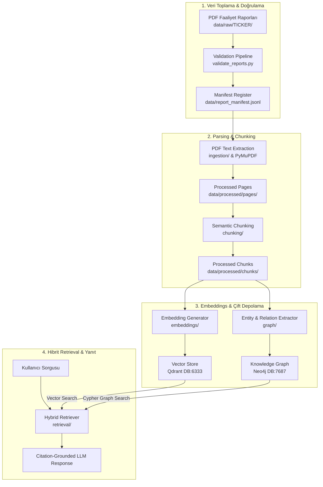

# Company Intelligence GraphRAG 🏢📊

[](https://www.python.org/downloads/release/python-3120/)
[](https://github.com/astral-sh/uv)
[](https://github.com/astral-sh/ruff)
[](http://mypy-lang.org/)
[](LICENSE)

**Company Intelligence GraphRAG**, BIST 100 şirketlerinin resmi yıllık ve entegre faaliyet raporlarını (PDF) işleyen, vektör tabanlı anlamsal arama (**Qdrant**) ile bilgi grafiği tabanlı varlık-ilişki çıkarımını (**Neo4j**) birleştiren hibrit bir Hibrit GraphRAG (Retrieval-Augmented Generation) sistemidir.

---

## 🎯 Proje Amacı

Kurumsal ve finansal analizlerde yalnızca vektör araması yapmak; karmaşık ortaklık yapıları, bağlı ortaklıklar, finansal metrik ilişkileri ve çok adımlı (multi-hop) mantıksal çıkarımlar için yetersiz kalmaktadır. Projenin temel amaçları:

1. **Doğrulanmış Baseline Veri Seti:** BIST şirketlerinin resmi kaynaklarından (yatırımcı ilişkileri & KAP) toplanmış, PyMuPDF metin ve hash doğrulamasından geçmiş faaliyet raporlarını işlemek.
2. **Hibrit Getiri (Hybrid Retrieval):** Metin içi anlamsal arama (Vector Search) ile şirket, yönetim kurulu, iştirak ve finansal rasyo ilişkilerini barındıran Bilgi Grafiğini (Knowledge Graph) tek potada eritmek.
3. **Kaynak Gösterimli Yanıt Üretimi (Citation-Grounded Generation):** Model çıktılarını doğrudan PDF sayfa numaraları ve metin bloklarıyla ilişkilendirerek halüsinasyonu engellemek.

---

## 🔄 Veri İşleme Akışı (Data Pipeline Flow)

Sistemin uçtan uca veri işleme, indeksleme ve sorgulama akışı aşağıdaki gibidir:



---

## 🖼️ Mimari Görsel ve Varlıklar

Projenin detaylı mimari diyagramları ve görsel varlıkları `docs/assets` klasöründe saklanmaktadır:
- **Mimari Diyagram Konumu:** `docs/assets/architecture.png` (veya SVG formatı)

---

## 📈 Proje Durumu & Baseline Veri Seti

Sistemin baseline faaliyet raporu toplama ve doğrulama aşaması **%100 tamamlanmıştır**. 10 hedef BIST şirketi için 2023, 2024 ve 2025 yıllarına ait 30/30 doğrulanmış PDF raporu `data/raw/<TICKER>/` klasöründe hazırdır:

| Şirket Kodu | Şirket Unvanı | 2023 Raporu | 2024 Raporu | 2025 Raporu | Baseline Durumu |
| :--- | :--- | :---: | :---: | :---: | :---: |
| **AKBNK** | Akbank T.A.Ş. | ✅ | ✅ | ✅ | **Tamamlandı (3/3)** |
| **ARCLK** | Arçelik A.Ş. | ✅ | ✅ | ✅ | **Tamamlandı (3/3)** |
| **ASELS** | Aselsan Elektronik A.Ş. | ✅ | ✅ | ✅ | **Tamamlandı (3/3)** |
| **FROTO** | Ford Otomotiv Sanayi A.Ş. | ✅ | ✅ | ✅ | **Tamamlandı (3/3)** |
| **KCHOL** | Koç Holding A.Ş. | ✅ | ✅ | ✅ | **Tamamlandı (3/3)** |
| **MGROS** | Migros Ticaret A.Ş. | ✅ | ✅ | ✅ | **Tamamlandı (3/3)** |
| **SISE** | Türkiye Şişe ve Cam Fabrikaları | ✅ | ✅ | ✅ | **Tamamlandı (3/3)** |
| **TCELL** | Turkcell İletişim Hizmetleri A.Ş. | ✅ | ✅ | ✅ | **Tamamlandı (3/3)** |
| **THYAO** | Türk Hava Yolları A.O. | ✅ | ✅ | ✅ | **Tamamlandı (3/3)** |
| **TUPRS** | Türkiye Petrol Rafinerileri A.Ş. | ✅ | ✅ | ✅ | **Tamamlandı (3/3)** |

---

## 🚀 Kurulum ve Başlangıç

### Önkoşullar
- **Python 3.12+**
- **uv** (Paket ve sanal ortam yöneticisi)
- **Docker Desktop** (Qdrant & Neo4j için)

### Adım 1: Bağımlılıkları Yükleme
```bash
make install
```

### Adım 2: Docker Servislerini Başlatma
Qdrant (`127.0.0.1:6333`) ve Neo4j (`127.0.0.1:7474`) servislerini ayağa kaldırın:
```bash
make services-up
```

### Adım 3: Sistem Bağlantı Kontrolü (Doctor)
Servislerin sağlık durumunu doğrulamak için `doctor` komutunu çalıştırın:
```bash
make doctor
```

---

## 🛠️ Geliştirme Komutları (Makefile)

Projede kullanılabilen tüm Makefile hedefleri aşağıda listelenmiştir:

| Komut | Açıklama |
| :--- | :--- |
| `make install` | `uv` ile projenin sanal ortamını ve tüm bağımlılıklarını kurar. |
| `make test` | `pytest` ile tüm birim ve entegrasyon testlerini çalıştırır. |
| `make lint` | `ruff check` ve `mypy` ile statik kod analizini yürütür. |
| `make format` | `ruff format` ve `ruff check --fix` ile koddaki biçimlendirmeleri otomatik düzeltir. |
| `make check` | Hem linting hem de test adımlarını ardışık çalıştırır (`test` + `lint`). |
| `make services-up` | `compose.yaml` ile Qdrant ve Neo4j Docker konteynerlerini arka planda başlatır. |
| `make services-down` | Çalışan Docker servislerini durdurur. |
| `make services-logs` | Docker servislerinin canlı log çıktılarını ekrana basar. |
| `make doctor` | Qdrant (`6333`) ve Neo4j (`7474`) HTTP bağlantı durumunu test eder. |

---

## 📦 Paket Mimarisi

```text
src/company_graphrag/
├── __init__.py
├── cli.py                  # Typer tabanlı CLI (doctor vb.)
├── config.py               # Pydantic Settings & çevre değişkenleri
├── ingestion/              # PDF metin ayıklama ve belge yükleme
├── chunking/               # Anlamsal metin bölümleme
├── embeddings/             # Vektör üretimi ve model sürücüleri
├── retrieval/              # Hibrit vektör + graf getiri motoru
├── storage/                # Qdrant & Neo4j veritabanı konnektörleri
└── graph/                  # Varlık-ilişki grafiği inşası ve Cypher sorguları
```

---

## 📄 Lisans

Bu proje MIT lisansı altında lisanslanmıştır.