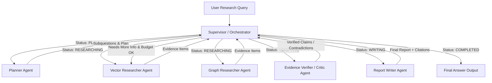

# 🤖 Multi-Agent Architecture & Shared State Design (Day 34)

## 🎯 Architectural Overview

Company Intelligence GraphRAG projesinin 34. Günü kapsamında geliştirilen bu mimari, mevcut **Vector RAG**, **Multi-Hop Knowledge Graph RAG** ve **Evaluation** modülleri üzerinde çalışan dayanıklı (resilient), typed state'e sahip çoklu ajanlı (multi-agent) araştırma asistanının temelini oluşturur.

Mevcut veri hatları (ingestion), PDF chunk kayıtları, Qdrant vektör koleksiyonu ve Neo4j bilgi grafiği **tamamen korunmuştur**. Ajanlar doğrudan veritabanı sürücülerine (`qdrant_client`, `neo4j.GraphDatabase`) erişemez; tüm etkileşimler strict typed tool kontratları ve soyutlama katmanları üzerinden yürütülür.

---

## 👥 Agent Roles & Specifications

Sistem 6 uzmanlaşmış ajan rolünden oluşur. Her ajanın yetki ve sorumluluk sınırları açıkça ayrıştırılmıştır:

### 1. Supervisor / Orchestrator
- **Sorumluluklar**: İş akışını yönetir, durum geçişlerini kontrol eder, ajanların sırasını belirler ve execution budget / retry sınırlarını denetler.
- **Girdiler**: `ResearchState`
- **Çıktılar**: `SupervisorOutput` (sonraki ajan rolü, tamamlanma durumu, gerekçe).
- **Kullanabileceği Araçlar**: `inspect_state_tool`, `update_status_tool`
- **Kullanamayacağı İşlemler**: Doğrudan Qdrant/Neo4j veritabanı sorguları çalıştırma, doğrudan PDF okuma, Verifier aşamasını atlayarak rapora geçme.
- **Başarı Koşulu**: Workflow `COMPLETED` durumuna ulaşır ve `final_answer` dolu olur.
- **Durma Koşulu**: `max_steps` (örn. 15), token limiti veya maksimum arama bütçesi aşıldığında.
- **Hata Durumu**: Hatanı loglar, status'ü `FAILED` yapar, `error` alanına hatayı yazar.

### 2. Planner
- **Sorumluluklar**: Kullanıcı sorgusunu analiz eder, şirket/ticker/yıl varlıklarını belirler, normalize eder ve araştırma planı ile alt soruları (`SubQuestion`) üretir.
- **Girdiler**: `PlannerInput` (`user_query`, `normalized_query`)
- **Çıktılar**: `PlannerOutput` (`normalized_query`, `research_plan`, `subquestions`)
- **Kullanabileceği Araçlar**: `entity_detector_tool`, `query_transformation_tool`
- **Kullanamayacağı İşlemler**: Doğrudan vektör veya grafik araması çalıştırmak, nihai raporu yazmak.
- **Başarı Koşulu**: Non-empty araştırma planı ve typed subquestions listesi üretilmesi.
- **Durma Koşulu**: Plan üretildiğinde veya 1 retry hakkı dolduğunda.
- **Hata Durumu**: Fallback olarak tek bir varsayılan alt soru üreterek devam eder.

### 3. Vector Researcher
- **Sorumluluklar**: Metinsel alt soruları Qdrant vektör koleksiyonunda arar, reranking uygular ve tam kaynak takibi olan `EvidenceItem` kayıtları üretir.
- **Girdiler**: `VectorResearcherInput` (`subquestion`, `candidate_k`, `top_k`)
- **Çıktılar**: `VectorResearcherOutput` (`evidence_items`, `summary`, `success`)
- **Kullanabileceği Araçlar**: `vector_search_tool`, `hybrid_rerank_tool`
- **Kullanamayacağı İşlemler**: `QdrantClient` nesnesini doğrudan ilklendirmek, Cypher çalıştırmak, koleksiyon şemasını değiştirmek.
- **Başarı Koşulu**: Alt soru ile eşleşen chunk'ları kaynak metadata'sı ile birlikte getirmek.
- **Durma Koşulu**: Alt soru tamamlandığında veya `max_search_calls` bütçesi dolduğunda.
- **Hata Durumu**: `warnings` alanına hatayı ekler, boş kanıt listesi döndürerek workflow'u bozmadan devam eder.

### 4. Graph Researcher
- **Sorumluluklar**: İlişkisel ve çok adımlı (multi-hop) alt soruları Neo4j Bilgi Grafiğinde arar, varlık-ilişki yollarını ve lineage bilgisini `EvidenceItem` kaydına dönüştürür.
- **Girdiler**: `GraphResearcherInput` (`subquestion`, `max_hops`, `limit`)
- **Çıktılar**: `GraphResearcherOutput` (`evidence_items`, `summary`, `success`)
- **Kullanabileceği Araçlar**: `graph_search_tool`, `cypher_intent_tool`
- **Kullanamayacağı İşlemler**: `neo4j.GraphDatabase` driver ilklendirmek, yıkıcı (`DELETE/SET`) Cypher sorgusu çalıştırmak.
- **Başarı Koşulu**: Çok adımlı grafik patikalarını lineage metadata'sı ile getirmek.
- **Durma Koşulu**: Arama tamamlandığında veya arama bütçesi dolduğunda.
- **Hata Durumu**: State uyarısı ekler, boş grafik kanıt listesi döndürür.

### 5. Evidence Verifier / Critic
- **Sorumluluklar**: Toplanan tüm kanıtları iddialara (`VerifiedClaim`) dönüştürür, çelişkileri (`Contradiction`) ve temelsiz iddiaları (`RejectedClaim`) tespit eder.
- **Girdiler**: `VerifierInput` (`user_query`, `evidence`)
- **Çıktılar**: `VerifierOutput` (`verified_claims`, `rejected_claims`, `contradictions`, `sufficient_evidence`)
- **Kullanabileceği Araçlar**: `claim_verifier_tool`, `contradiction_detector_tool`
- **Kullanamayacağı İşlemler**: Yeni veritabanı araması başlatmak, nihai kullanıcı cevabını yazmak.
- **Başarı Koşulu**: Tüm iddiaların kaynak kanıtları ile eşleştirilip doğrulanması veya reddedilmesi.
- **Durma Koşulu**: Kanıt doğrulama tamamlandığında.
- **Hata Durumu**: Doğrulanmamış tüm iddiaları reddeder ve ek vektör araması talep eder.

### 6. Report Writer
- **Sorumluluklar**: Doğrulanmış iddiaları (`verified_claims`) ve kanıtları sentezleyerek kaynak atıflı (`[1]`, `[2]`) Markdown raporu oluşturur.
- **Girdiler**: `ReportWriterInput` (`user_query`, `verified_claims`, `evidence`, `contradictions`)
- **Çıktılar**: `ReportWriterOutput` (`final_report`, `citations`, `source_coverage_ratio`)
- **Kullanabileceği Araçlar**: `report_formatter_tool`, `citation_linker_tool`
- **Kullanamayacağı İşlemler**: Arama araçlarını çağırmak, doğrulanmamış iddiaları rapora eklemek, sahte kaynak numarası uydurmak.
- **Başarı Koşulu**: Tam doğrulanmış atıflara sahip Markdown raporun üretilmesi.
- **Durma Koşulu**: Rapor üretimi ve citation doğrulama tamamlandığında.
- **Hata Durumu**: Temel doğrulanmış iddiaları içeren fallback uyarı raporu oluşturur.

---

## 🔒 Typed Shared State (`ResearchState`)

Ajanlar arasında veri aktarımı Pydantic v2 tabanlı `ResearchState` veri yapısı ile sağlanır:

| Alan Adı | Tip | Açıklama |
| :--- | :--- | :--- |
| `run_id` | `str` | Benzersiz çalışma kimliği |
| `user_query` | `str` | Orijinal kullanıcı sorusu |
| `normalized_query` | `str` | Temizlenmiş ve varlıkları tespit edilmiş sorgu |
| `research_plan` | `list[str]` | Planner tarafından oluşturulan adım adım plan |
| `subquestions` | `list[SubQuestion]` | Araştırma alt soruları |
| `completed_tasks` | `list[str]` | Tamamlanan görev kimlikleri |
| `pending_tasks` | `list[str]` | Bekleyen görev kimlikleri |
| `evidence` | `list[EvidenceItem]` | Toplanan kanıtlar (Zorunlu kaynak metadata'lı) |
| `verified_claims` | `list[VerifiedClaim]` | Verifier tarafından doğrulanan iddialar |
| `rejected_claims` | `list[RejectedClaim]` | Reddedilen iddialar |
| `contradictions` | `list[Contradiction]` | Kaynaklar arası çelişkiler |
| `citations` | `list[CitationItem]` | Raporda kullanılan nihai atıflar |
| `warnings` | `list[str]` | Çalışma esnasında oluşan uyarılar |
| `retry_count` | `dict[str, int]` | Ajan bazlı deneme/retry sayaçları |
| `tool_calls` | `list[ToolCallRecord]` | Araç çağrı denetim kaydı (audit log) |
| `execution_budget` | `ExecutionBudget` | Bütçe ve döngü sınırlayıcı nesne |
| `final_answer` | `str \| None` | Nihai sentez raporu |
| `status` | `AgentWorkflowStatus` | `PENDING`, `PLANNING`, `RESEARCHING`, `VERIFYING`, `WRITING`, `COMPLETED`, `FAILED` |
| `error` | `str \| None` | Global hata açıklaması |

---

## 📍 Kanıt Kaynak Takibi (Evidence Provenance)

Her `EvidenceItem` kaydı zorunlu olarak şu 8 metadata alanını barındırır:
1. `company` (Şirket adı)
2. `ticker` (BIST Ticker)
3. `year` (Rapor yılı)
4. `report` (Rapor türü)
5. `chunk_id` (Benzersiz chunk kimliği)
6. `page_number` (Sayfa numarası)
7. `source_file` (PDF dosya adı)
8. `retrieval_method` (`vector_search`, `graph_traversal`, `hybrid_search`, `multi_hop`)

---

## 🛑 Limitler, Bütçe ve Sonsuz Döngü Koruması (`ExecutionBudget`)

Sistemde ajanların sonsuz planlama veya araştırma döngüsüne girmesini önlemek amacıyla 4 kademeli koruma mekanizması tanımlanmıştır:

1. **Max Total Steps (`max_steps = 15`)**: Ajanlar arası toplam durum geçiş sayısı 15'i aşamaz.
2. **Max Search Calls (`max_search_calls = 10`)**: Vektör veya grafik araması toplamda 10 çağrıyı geçemez.
3. **Max Retries per Agent (`max_retries_per_agent = 3`)**: Bir ajan rolü üst üste en fazla 3 kez hata verip retry yapabilir.
4. **Token Ceiling (`max_tokens = 32,000`)**: Toplam tahmini token tüketimi sınırı.

Bütçe aşımı gerçekleştiğinde Supervisor iş akışını derhal durdurur ve mevcut toplanmış en iyi verilerle fallback yanıtı üretir.
