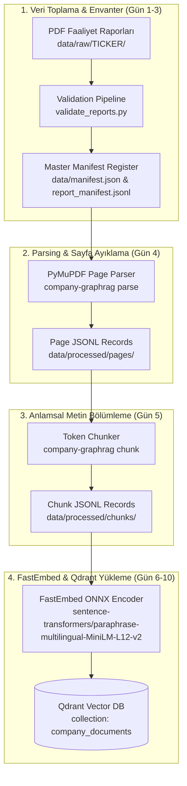

# 🔄 Company Intelligence GraphRAG - Data Pipeline Documentation

## 🎯 Architectural Architecture & Flow

Company Intelligence GraphRAG veri işleme boru hattı 4 ana katmandan oluşmaktadır:

---

## ⚙️ Boru Hattı Katmanları ve Kuralları

### Katman 1: Veri Toplama ve Doğrulama
- 10 hedef şirket için 3 Yıl (2023-2025) PDF faaliyet raporları indirilir.
- SHA-256 dijital parmak izleri hesaplanır, mükerrer dosyalar karantinaya alınır.
- Standart isimlendirme kuralı: `{TICKER}__{YEAR}__{REPORT_TYPE}__{LANGUAGE}.pdf`

### Katman 2: PDF Parsing (Sayfa Ayrıştırma)
- PyMuPDF (`fitz`) kütüphanesi kullanılarak her PDF sayfa bazında ayrıştırılır.
- Boş sayfalar veya görsel ağırlıklı sayfalar `needs_ocr=true` olarak işaretlenir.
- Her PDF için 1 adet `data/processed/pages/{TICKER}/{doc_id}.jsonl` dosyası oluşturulur.

### Katman 3: Semantic Chunking (Metin Bölümleme)
- Paragraf ve cümle sınırları korunarak token hesabı yapılır.
- Target chunk boyutu: **500 token**, Overlap boyutu: **50 token**.
- `data/processed/chunks/{TICKER}/{doc_id}_chunks.jsonl` formatında kaydedilir.

### Katman 4: Vektör İndeksleme (Qdrant Vector DB)
- FastEmbed ONNX `sentence-transformers/paraphrase-multilingual-MiniLM-L12-v2` modeli ile 384-boyutlu vektörler üretilir.
- Deterministik UUIDv5 point ID ile Qdrant veritabanındaki `company_documents` koleksiyonuna yüklenir.
- 11 metadata alanı payload içinde saklanır.
