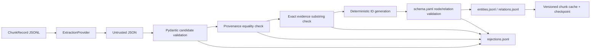

# Entity ve Relation Extraction Pipeline

Gün 19 pipeline’ı mevcut chunk JSONL kayıtlarından entity ve relation adayları çıkarır; hiçbir adayı doğrudan graph kaydı olarak kabul etmez. Tek doğruluk kaynağı Gün 18’deki
[`schema.yaml`](../src/company_graphrag/graph/schema.yaml) ve `GraphSchemaManager` doğrulayıcısıdır.

Pipeline Neo4j’e veri yazmaz ve chunking, embedding, Qdrant veya retrieval katmanlarını değiştirmez.

## Akış



Uygulama bileşenleri:

- [`pipeline.py`](../src/company_graphrag/graph/extraction/pipeline.py): doğrulama, kimlik, cache, checkpoint ve JSONL yazımı.
- [`models.py`](../src/company_graphrag/graph/extraction/models.py): untrusted aday, kabul, ret, cache ve metrik Pydantic modelleri.
- [`provider.py`](../src/company_graphrag/graph/extraction/provider.py): LLM sağlayıcı protokolü ve ağsız deterministik sağlayıcı.

## Güvenlik ve doğrulama kuralları

Sağlayıcı çıktısı tam olarak `entities` ve `relations` listelerini içeren bir JSON nesnesi olmalıdır. Her aday:

1. Pydantic ile strict olarak parse edilir; bilinmeyen alanlar reddedilir.
2. `type` değeri doğrudan `schema.yaml` node/relation anahtarlarına karşı kontrol edilir.
3. `source_chunk_id`, `source_file` ve `page_number` değerleri güvenilir `ChunkRecord` ile birebir eşleşmelidir.
4. `evidence_text`, `ChunkRecord.text` içinde exact substring olarak bulunmalıdır. Whitespace veya karakter normalizasyonu yapılmaz.
5. `id` ile graph provenance alanları sağlayıcıdan alınmaz; schema kimlik tarifi ve güvenilir chunk metadata’sından yeniden üretilir.
6. Son property kümesi `GraphSchemaManager.validate_node_dict` veya `validate_relationship` ile doğrulanır.
7. Relation yerel `source_ref`/`target_ref` değerleri yalnızca aynı yanıtta kabul edilmiş entity’lere çözümlenir ve şemadaki yön kontrol edilir.

Bozuk JSON, eksik provenance, bilinmeyen tip, yanlış endpoint, şema hatası ve bulunmayan evidence gibi durumlar
`rejections.jsonl` içinde deterministik `rejection_id`, `reason_code`, açık `reason` ve özgün adayla saklanır.

## Idempotency ve devam desteği

Cache anahtarı şu dört değere bağlıdır:

- `chunk_id`
- chunk içeriği ve metadata’sının SHA-256 fingerprint’i
- `schema.yaml` sürümü
- `extraction_version`

Her chunk sonucu `.cache/<version>_<hash>/<chunk_id>.json` altında atomik yazılır. `checkpoint.json`, tamamlanan sürüm/chunk çiftlerini ve cache dosyasını tutar. Aynı sürüm ve değişmemiş chunk tekrar işlendiğinde sağlayıcı çağrılmaz. Kabul ve ret JSONL dosyalarında sırasıyla `(extraction_version, id)` ve `rejection_id` üzerinden duplicate engellenir.

Extraction sürümü değişirse aynı graph kimlikleri yeni sürüm etiketiyle yeniden değerlendirilebilir; eski sonuçlar sessizce overwrite edilmez.

## Çıktı sözleşmesi

Kabul edilen entity kayıtları şu üst alanları taşır:

`id`, `type`, `canonical_name`, `properties`, `source_chunk_id`, `source_file`, `page_number`, `evidence_text`, `confidence`, `extraction_version`.

Relation kayıtları:

`id`, `type`, `source_entity_id`, `target_entity_id`, `properties`, `source_chunk_id`, `source_file`, `page_number`, `evidence_text`, `confidence`, `extraction_version`.

`properties`, Gün 18 graph şemasına yazılabilecek tam property kümesidir; deterministik `id` ve schema’nın istediği provenance alanlarını içerir.

## Küçük temsilî çalışma

Örnek script, mevcut
`ASELS__2024__annual_report__tr_chunks.jsonl` dosyasından yalnızca iki chunk seçer:

- `9ae32e0219bce5d6`: 2024 toplam hasılat metriği
- `bc9ba3dc0a3d1242`: Ahmet Akyol CEO/Genel Müdür bilgisi

Gerçek API veya LLM çağrısı yapılmaz. Bir adet kaynakta bulunmayan evidence adayı bilerek eklenerek ret yolu da doğrulanır.

```bash
uv run python scripts/run_graph_extraction_sample.py
```

İkinci geçiş cache davranışını gösterir. Tek geçiş için `--single-run` kullanılabilir.

Son örnek denetim sonucu:

| Metrik | Sonuç |
| --- | ---: |
| İşlenen chunk | 2 |
| Entity | 4 |
| Relation | 3 |
| Ret | 1 |
| Ortalama confidence | 0.9771 |
| Cache hit | 2 |
| Provider çağrısı, ikinci geçiş | 0 |

Entity dağılımı: `Company=1`, `Date=1`, `FinancialMetric=1`, `Person=1`.

Relation dağılımı: `FOR_DATE=1`, `HOLDS_ROLE_AT=1`, `REPORTED_METRIC=1`.

Üretilen dosyalar:

- [`entities.jsonl`](../data/graph/sample_day19/entities.jsonl)
- [`relations.jsonl`](../data/graph/sample_day19/relations.jsonl)
- [`rejections.jsonl`](../data/graph/sample_day19/rejections.jsonl)
- [`audit_report.json`](../data/graph/sample_day19/audit_report.json): örnek kabul ve ret kayıtları dahil toplu rapor
- [`checkpoint.json`](../data/graph/sample_day19/checkpoint.json)
- [`metrics.json`](../data/graph/sample_day19/metrics.json)

## Test

```bash
uv run pytest tests/test_graph_extraction.py
```

Testler geçerli entity/relation, bilinmeyen tip, eksik veya uyuşmayan provenance, chunk’ta bulunmayan evidence, Gün 18 şema hatası, deterministik ID, duplicate önleme, cache hit, bozuk JSON, yanlış ilişki yönü ve bozuk input chunk senaryolarını kapsar.
