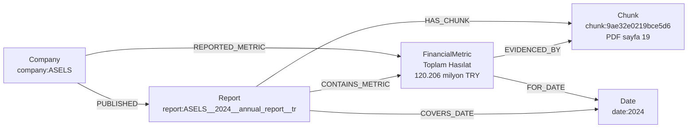

# Graph Schema ve Ontology

Bu belge, faaliyet raporları için GraphRAG şemasının ilk sürümünü tanımlar. Makine tarafından okunan asıl sözleşme
[`schema.yaml`](../src/company_graphrag/graph/schema.yaml), Neo4j 5 Community için uygulanabilir fiziksel plan ise
[`neo4j_schema.cypher`](../data/neo4j_schema.cypher) dosyasıdır.

## Tasarım sınırı

İlk sürüm üç ilkeye göre küçük tutulmuştur:

1. Rapordan çıkarılan her iddia `source_report_id`, `source_chunk_id` ve `source_page` ile doğrulanabilir olmalıdır.
2. `Chunk`, mevcut Qdrant payload’ı ile Neo4j arasında ortak kanıt ankrajıdır; tam metnin Neo4j’de tutulması zorunlu değildir.
3. Aynı adın gerçekten aynı varlık olduğu kesin değilse birleştirme yapılmaz. Bu nedenle `Person` ve `Product` kimlikleri şirket kapsamındadır; farklı raporlardaki finansal gözlemler de kaynak rapor bazında ayrılır.

İncelenen veri hattında 30 doğrulanmış rapor; 7.325 sayfa ve 25.859 chunk üretmektedir. Mevcut
`ChunkRecord` alanlarının tamamı şemada karşılanır:

| Mevcut alan | Graph karşılığı |
| --- | --- |
| `chunk_id` | `Chunk.chunk_id`; düğüm kimliği `chunk:{chunk_id}` |
| `document_id` | `Report.document_id`, `Chunk.document_id`; rapor kimliği `report:{document_id}` |
| `company`, `ticker`, `year`, `report_type`, `language` | `Report` alanları ve isteğe bağlı denormalize `Chunk` alanları |
| `page_number`, `chunk_index`, `source_file` | Zorunlu `Chunk` citation koordinatları |
| `token_count`, `text` | İsteğe bağlı `Chunk` alanları; tam metnin birincil deposu Qdrant olabilir |

`source_page`, PDF’in 1’den başlayan fiziksel sayfa numarasıdır; raporda basılı görünen sayfa etiketi değildir.

## Node tipleri

| Node | Zorunlu alanlar | Opsiyonel alanlar | Benzersiz kimlik | Kaynak gösterme |
| --- | --- | --- | --- | --- |
| `Company` | `id`, `name`, `ticker` | `legal_name`, `aliases`, `country`, `website`, kaynak alanları | `company:{UPPER_TICKER}` | `companies.yaml` gibi kanonik kaynaktan gelebilir; rapor/chunk/sayfa opsiyoneldir |
| `Report` | `id`, `document_id`, `ticker`, `year`, `report_type`, `language`, `source_file`, `sha256` | `source_url`, `source_domain`, `total_pages`, `validation_status` | `report:{document_id}`; dil `document_id` içinde olduğu için çakışmaz | `source_file` ve `sha256` zorunlu; URL ve doğrulama durumu opsiyonel |
| `Chunk` | `id`, `chunk_id`, `report_id`, `document_id`, `source_file`, `page_number`, `chunk_index` | Mevcut diğer chunk metadata alanları ve `text` | `chunk:{lower_chunk_id}` | Kendi `report_id` + PDF sayfası doğrudan citation’dır |
| `Person` | `id`, `name`, `normalized_name`, `company_id`, üç kaynak alanı | `aliases` | `person:{TICKER}:{ascii_snake_name}` | Rapor, chunk ve sayfa zorunlu; görev bilgisi `HOLDS_ROLE_AT` üzerindedir |
| `Product` | `id`, `name`, `normalized_name`, `company_id`, üç kaynak alanı | `category`, `description`, `brand` | `product:{TICKER}:{ascii_snake_name}` | Rapor, chunk ve sayfa zorunlu |
| `Sector` | `id`, `name`, `normalized_name` | Sınıflandırma kodu ve kaynak alanları | `sector:{ascii_snake_name}` | Kontrollü sözlükten gelebilir; şirket–sektör iddiasının kanıtı `OPERATES_IN` üzerindedir |
| `FinancialMetric` | `id`, `metric_key`, `name`, `value`, `unit`, `company_id`, `date_id`, `scope`, üç kaynak alanı | `reported_value`, `scale`, `statement`, `notes`, `confidence` | `metric:{TICKER}:{sha256_24}`; hash girdileri şirket, metrik, tarih, kapsam ve kaynak rapordur | Rapor, chunk ve sayfa zorunlu |
| `Event` | `id`, `title`, `normalized_title`, `event_type`, `company_id`, `date_id`, üç kaynak alanı | `description`, `status`, `confidence` | `event:{TICKER}:{sha256_24}`; hash girdileri şirket, tarih, başlık ve kaynak rapordur | Rapor, chunk ve sayfa zorunlu |
| `Date` | `id`, `value`, `granularity` | `start_date`, `end_date`, `fiscal_year`, `quarter` | `date:{value}`; değer `YYYY`, `YYYY-Qn`, `YYYY-MM` veya `YYYY-MM-DD` | Kanonik zaman düğümüdür; iddianın kanıtı bağlı fact/relation üzerinde kalır |

`FinancialMetric.value`, raporda görülen sayısal değerdir. Ölçekli tablolar için `scale` çarpanı kullanılır. Örneğin
`value=120206`, `unit=TRY`, `scale=1000000`, `reported_value="120.206 milyon TL"` biçimi hem sorgulanabilir değeri hem özgün gösterimi korur. Farklı bir raporda yeniden sunulan veya düzeltilen aynı dönem metriği, `source_report_id` kimlik girdisi olduğu için sessizce öncekinin üzerine yazılmaz.

## İlişki tipleri

Bütün ilişkiler yönlüdür. Kimlikleri, ilişki türü + uç düğüm kimlikleri + tabloda belirtilen ayırt edici alanların pipe (`|`) ile birleştirilmiş kanonik gösteriminin SHA-256 özetinden ilk 24 hex karakter alınarak üretilir:

`rel:{lower_relation_type}:{sha256_24}`

| İlişki | Yön | Zorunlu alanlar | Opsiyonel alanlar ve kimlik niteleyicisi |
| --- | --- | --- | --- |
| `PUBLISHED` | `Company → Report` | `id`, `source_report_id` | `source_manifest`; kimlik uç düğümlerden |
| `HAS_CHUNK` | `Report → Chunk` | `id`, `source_report_id`, `source_page` | Yok; kimlik uç düğümlerden |
| `COVERS_DATE` | `Report → Date` | `id`, `source_report_id` | Yok; kimlik uç düğümlerden |
| `OPERATES_IN` | `Company → Sector` | `id` ve üç kaynak alanı | `confidence`; kimlikte `source_report_id` bulunur |
| `OFFERS` | `Company → Product` | `id` ve üç kaynak alanı | `confidence`; kimlikte `source_report_id` bulunur |
| `HOLDS_ROLE_AT` | `Person → Company` | `id`, `role` ve üç kaynak alanı | `start_date_id`, `end_date_id`, `confidence`; kimlikte rol ve kaynak rapor bulunur |
| `REPORTED_METRIC` | `Company → FinancialMetric` | `id` ve üç kaynak alanı | Yok; kimlikte `source_report_id` bulunur |
| `CONTAINS_METRIC` | `Report → FinancialMetric` | `id` ve üç kaynak alanı | Yok; kimlikte `source_chunk_id` bulunur |
| `FOR_DATE` | `FinancialMetric → Date` | `id` ve üç kaynak alanı | Yok; kimlikte `source_report_id` bulunur |
| `EXPERIENCED` | `Company → Event` | `id` ve üç kaynak alanı | Yok; kimlikte `source_report_id` bulunur |
| `DESCRIBES_EVENT` | `Report → Event` | `id` ve üç kaynak alanı | Yok; kimlikte `source_chunk_id` bulunur |
| `OCCURRED_ON` | `Event → Date` | `id` ve üç kaynak alanı | Yok; kimlikte `source_report_id` bulunur |
| `OWNS` | `Company → Company` | `id` ve üç kaynak alanı | `ownership_percent`, `direct`, `date_id`, `confidence`; kimlikte `source_report_id` bulunur |
| `EVIDENCED_BY` | `Person/Product/Sector/FinancialMetric/Event → Chunk` | `id`, `source_report_id`, `source_page` | `extraction_method`, `confidence`; kimlik uç düğümlerden |

“Üç kaynak alanı” `source_report_id`, `source_chunk_id` ve `source_page` anlamına gelir. `EVIDENCED_BY`, bu alanları traversable bir graph bağlantısına dönüştürür; alanların düğüm ve claim ilişkilerinde de tutulması doğrudan denetim ve filtreleme içindir.

## Örnek: ASELSAN 2024 toplam hasılatı

Bu örnek repository’deki gerçek chunk metadata’sını kullanır:

- Rapor: `ASELS__2024__annual_report__tr.pdf`
- PDF SHA-256: `3ea55a1f8c7118f2e55c316516cd2fd0d0ae8070bc5acf1b96e5abd87580f202`
- Chunk: `9ae32e0219bce5d6`
- PDF sayfası: `19`
- Kaynak gösterim: “Toplam Hasılat (Milyon TL) 2024 120.206”



Örnek düğüm kaydı:

```yaml
label: FinancialMetric
properties:
  id: "metric:ASELS:1850b44ae9a94e4790efee69"
  metric_key: "toplam_hasilat"
  name: "Toplam Hasılat"
  value: 120206.0
  unit: "TRY"
  scale: 1000000
  reported_value: "120.206 milyon TL"
  company_id: "company:ASELS"
  date_id: "date:2024"
  scope: "CONSOLIDATED"
  source_report_id: "report:ASELS__2024__annual_report__tr"
  source_chunk_id: "9ae32e0219bce5d6"
  source_page: 19
```

Bu yapı, yanıt üreticisinin metriği bulduktan sonra `EVIDENCED_BY` ile chunk’a, `HAS_CHUNK` ile rapora ve `source_page` ile PDF sayfasına geri dönmesini sağlar.

## Neo4j constraint ve index planı

Plan Neo4j 5 Community ile uyumludur:

- Dokuz node label’ının tamamında `id` uniqueness constraint vardır.
- Doğal anahtarlar için ayrıca `Company.ticker`, `Report.document_id`, `Chunk.chunk_id` ve `Date.value` benzersizdir.
- Rapor, citation, kişi, ürün, sektör, metrik ve olay sorguları için bileşik/range index’leri vardır.
- Şirket, kişi, ürün, sektör ve olay isimleri için tek bir full-text index vardır.
- `EVIDENCED_BY.source_report_id` ve `HOLDS_ROLE_AT.role` relationship index’leri denetim ve rol sorgularını hızlandırır.

Neo4j Community’de taşınabilir relationship uniqueness ve property-existence constraint varsayılmamıştır. Bu iki kural uygulamada doğrulanır; ilişki yükleme işlemi deterministik `id` ile `MERGE` kullanmalıdır. Fiziksel planı görüntülemek veya yeniden üretmek için:

```bash
uv run company-graphrag graph-schema
uv run company-graphrag graph-schema --export-cypher data/neo4j_schema.cypher
```

## Doğrulama

Yükleyici aşağıdaki hataları graph’a yazmadan önce reddeder:

- bilinmeyen node veya ilişki tipi;
- yanlış ilişki yönü/uç label’ı;
- eksik zorunlu veya bilinmeyen property;
- yanlış scalar tip, enum, regex veya numeric sınır;
- şemada tanımsız ID/provenance alanı;
- var olmayan label/property kullanan constraint veya index.

Testler ayrıca mevcut `ChunkRecord` metadata alanlarının şemada kaybolmadığını, kimliklerin deterministik olduğunu ve
[`neo4j_schema.cypher`](../data/neo4j_schema.cypher) çıktısının YAML planıyla aynı kaldığını denetler:

```bash
uv run pytest tests/test_graph_schema.py
```
