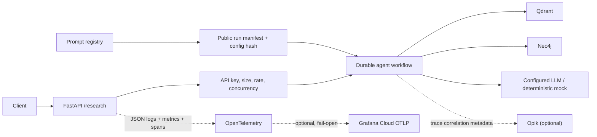

# LLMOps Architecture

The API is stateless except for the existing JSON workflow checkpoints and run manifests. Those files are suitable for a single local instance; durable multi-instance Cloud Run execution requires external object storage or a managed task store and remains a documented limitation. Staging is therefore capped at one instance.

## Trace spans

The implemented chain is `HTTP request` (FastAPI instrumentation), `research_workflow`, `planner_agent`, `vector_retrieval` or `graph_retrieval`, `hybrid_result_fusion`, `citation_validation`, and `answer_synthesis`. Attributes use IDs, counts, versions, and timing—not prompt bodies or document text.

## Version model

`config/prompts.yaml` owns prompt text and metadata. `company-graphrag version-check` rejects content/hash drift. A manifest allowlists application, prompt, model, embedding, chunking, collection, schema, retrieval, workflow, citation, eval, and environment versions. Canonical sorted JSON is SHA-256 hashed. Credentials, endpoints, headers, user queries, and document content are excluded.
