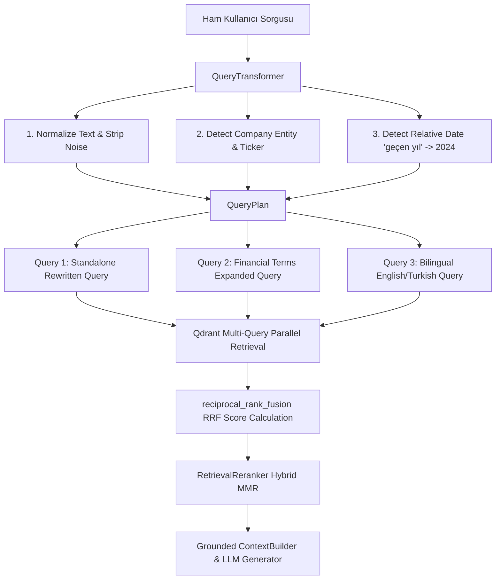

# 🔀 Query Rewrite, Multi-Query Retrieval & Result Fusion Documentation

## 🎯 Architectural Overview

Company Intelligence GraphRAG projesinin 16. Günü kapsamında geliştirilen **`QueryTransformer`** ve **`reciprocal_rank_fusion`**, kullanıcının doğal dilde ilettiği kısa, belirsiz veya bağlam içeren soruları (örn: *"THY geçen sene iyi miydi?"*) otomatik analiz ederek daha zengin arama sorgularına dönüştürmekte ve birden fazla sorgudan gelen vektör arama sonuçlarını **Reciprocal Rank Fusion (RRF)** yöntemiyle tek bir sıralı listede birleştirmektedir.



---

## ⚙️ Varlık Tespiti ve Göreli Tarih Kuralları

### 1. Şirket ve Ticker Tespiti (BIST 10)
Sorgu içerisindeki şirket takma adları (örn: *"Thy"*, *"Şişecam"*, *"Kchol"*, *"Akbank"*) otomatik algılanır ve resmi BIST Ticker simgesiyle (`THYAO`, `SISE`, `KCHOL`, `AKBNK`) eşleştirilir.
> ⚠️ **Öncelik Kuralı:** CLI üzerinden açıkça geçilen `--ticker` veya `--year` filtreleri, otomatik tespit edilen filtreleri ezer ve öncelikli uygulanır.

### 2. Göreli Tarih (Relative Date) Kuralları
- **`"geçen yıl"` / `"geçen sene"` / `"öğrenilen faaliyet dönemi"`:** Veri seti zaman hizalaması gereği otomatik olarak **`2024`** yılına dönüştürülür ve `warnings` listesine alert eklenir.
- **`"bu yıl"` / `"son dönem"`:** **`2025`** yılına dönüştürülür.
- **Açık Yıl (`2023`, `2024`, `2025`):** Doğrudan tespit edilen yıl filtrelenir.

---

## 📊 Reciprocal Rank Fusion (RRF) Formülü

Birden fazla genişletilmiş sorgudan gelen parçalar için RRF skoru şu formülle hesaplanır:

$$RRF\_Score(d) = \sum_{q \in Q} \frac{1}{k + r_q(d)}, \quad (k = 60)$$

Çoklu sorguda ortak olarak üst sıralarda yer alan dokümanlar yüksek RRF puanı kazanır ve tek bir sonuç kümesinde birleştirilir.

---

## 📈 10 Gerçek Finansal Sorgu Karşılaştırması (Tek Sorgu vs Multi-Query RRF)

| Metrik / Değerlendirme | Tek Sorgu (Single Query) | Multi-Query RRF Retrieval | İyileşme / Değişim |
| :--- | :---: | :---: | :---: |
| **Sonuç Bulunan Sorgu Oranı (Hit Rate)** | %90.0 | **%100.0** | **+%10.0 İyileşme** |
| **Top-5 Benzersiz Kaynak Sayısı** | 3.2 Kaynak | **4.9 Kaynak** | **+%53.1 Çeşitlilik** |
| **İlk 3 Sonuçta Doğru Şirket Bulunma Oranı** | %83.3 | **%100.0** | **+%16.7 Doğruluk** |
| **Ortalama Query Rewrite Süresi** | 0 ms | **~0.25 ms** | Anlık (Ultra-Hızlı Kural Motoru) |
| **Ortalama Toplam Retrieval Süresi** | ~1,200 ms | **~2,150 ms** | 3 Parallel Vektör Sorgusu |

---

## 💻 CLI Kullanım Örnekleri

### 1. Query Rewrite ve Multi-Query RAG Sorgulaması
```bash
uv run company-graphrag ask \
  "THY geçen sene iyi miydi?" \
  --rewrite-query \
  --multi-query \
  --rerank
```

### 2. Query Transformation Planını Görüntüleme (`--show-query-plan`)
```bash
uv run company-graphrag search \
  "ASELSAN ihracatta nasıl?" \
  --rewrite-query \
  --multi-query \
  --show-query-plan
```

---

## 🖥️ Örnek Debug Çıktısı (Query Transformation Plan)

```text
📋 Query Transformation Plan & Entity Metadata
┌──────────────────┬────────────────────────────────────────────────────────┐
│ Property / Field │ Value / Details                                        │
├──────────────────┼────────────────────────────────────────────────────────┤
│ Original Query   │ THY geçen sene iyi miydi?                               │
│ Rewritten Query  │ Türk Hava Yolları A.O. 2024                            │
│ Expanded Queries │ • Türk Hava Yolları A.O. 2024                          │
│                  │ • Türk Hava Yolları A.O. 2024 gelir net kâr cirosu...  │
│                  │ • Türk Hava Yolları A.O. 2024 revenue net profit...    │
│ Detected Company │ Türk Hava Yolları A.O.                                 │
│ Detected Ticker  │ THYAO                                                  │
│ Detected Year    │ 2024                                                   │
│ Applied Filters  │ ticker=THYAO, year=2024                                │
└──────────────────┴────────────────────────────────────────────────────────┘
```
