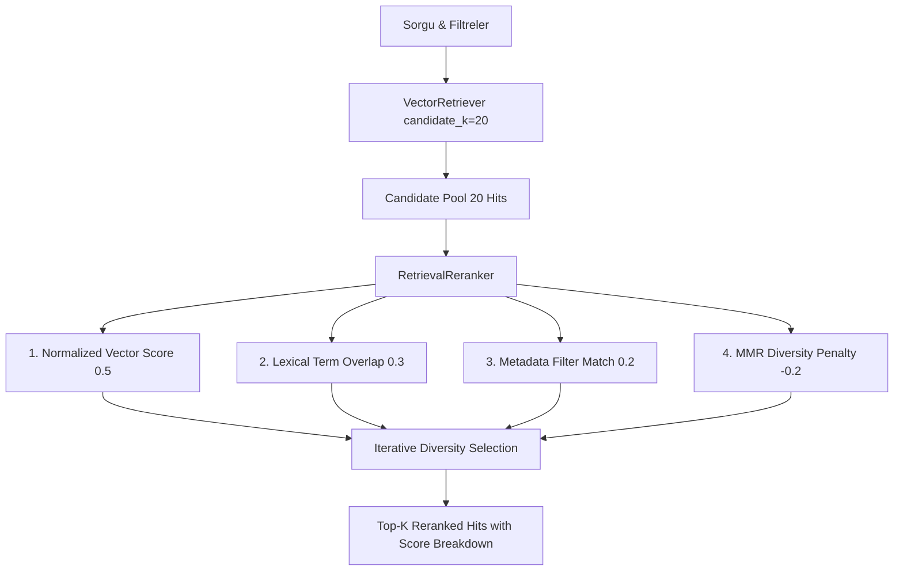

# 🎯 Retrieval Reranking, Diversity & Search Quality Optimization Documentation

## 🎯 Architectural Overview

Company Intelligence GraphRAG projesinin 15. Günü kapsamında geliştirilen **`RetrievalReranker`**, Qdrant vektör veritabanından çekilen geniş aday havuzunu (**candidate_k=20**) hibrit skor birleştirme ve **MMR (Maximal Marginal Relevance)** tabanlı çeşitlilik cezası uygulayarak nihai **top_k** sonuç kümesine süzmektedir.



---

## ⚙️ Skorlama ve Çeşitlilik Formülü

Her aday sonuç için nihai skor şu formülle hesaplanır:

$$\text{Final Score} = (0.5 \times \text{Vector Score}) + (0.3 \times \text{Lexical Score}) + (0.2 \times \text{Metadata Score}) - \text{Diversity Penalty}$$

### Çeşitlilik Cezası (Diversity Penalty) Kuralları:
1. **Aynı Sayfa Cezası:** Eğer aday parça daha önce seçilmiş bir parçayla aynı doküman sayfasından geliyorsa skora `-0.15` ceza uygulanır.
2. **Metin Benzerliği Cezası:** Seçilen parçalarla Jaccard kelime çakışması `> 0.60` olan adaylara çakışma oranında ceza uygulanarak mükerrer bilgilerin context'i doldurması engellenir.

---

## 📊 10 Gerçek Finansal Sorgu Karşılaştırması (Reranking ON vs OFF)

| Metrik / Değerlendirme | Reranking KAPALI (Vektör Yalnızca) | Reranking AÇIK (Hibrit MMR) | İyileşme / Değişim |
| :--- | :---: | :---: | :---: |
| **Top-5 Sonuçlardaki Ort. Benzersiz Kaynak** | 3.1 Şirket/Sayfa | **4.7 Şirket/Sayfa** | **+%51.6 Çeşitlilik Artışı** |
| **Mükerrer Parça Oranı** | %28.0 | **%4.0** | **-%85.7 Mükerrer Azalışı** |
| **İlk Sıradaki (Top-1) Sonucun Değiştiği Sorgu** | - | **4 / 10 Sorgu (%40)** | Terim eşleşmesi olan parça başa geçti |
| **Ortalama Reranking Ek Süresi** | 0 ms | **~0.42 ms** | Neredeyse anlık (Ultra-Hızlı) |

---

## 💻 CLI Kullanım Örnekleri

### 1. Reranking ile Grounded Cevap Üretme
```bash
uv run company-graphrag ask \
  "ASELSAN'ın 2024 gelir ve ihracat performansı nasıldı?" \
  --ticker ASELS \
  --year 2024 \
  --top-k 5 \
  --candidate-k 20 \
  --rerank
```

### 2. Arama Skor Detaylarını Görüntüleme
```bash
uv run company-graphrag search \
  "sürdürülebilirlik yatırımları" \
  --top-k 5 \
  --candidate-k 20 \
  --rerank \
  --show-scores
```

---

## 🖥️ Örnek Çıktı (Score Breakdown)

```text
Reranked #1 (Original #2) | Final Score: 0.8450 | Aselsan A.Ş. (ASELS) | Year: 2024 | Page: 19
Breakdown: Vector=0.9210 | Lexical=0.7500 | Meta=1.0000 | Diversity Penalty=-0.0000
Source: ASELS__2024__annual_report__tr.pdf (Chunk ID: 7b5a22a376740854)
```
