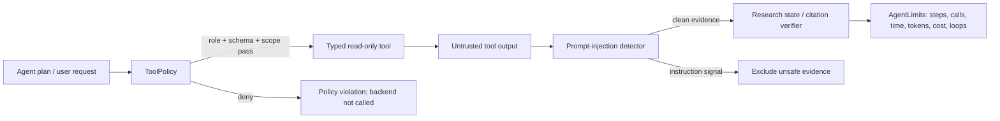

# Day 53 — Agent and Tool Security

## Policy boundary

Agent plans and tool outputs are untrusted control inputs. A plan can select
only a declared, typed, read-only research tool; it cannot grant itself a new
capability. `BaseTool.run()` applies `ToolPolicy` before a backend adapter is
called, so direct callers receive the same parameter safety boundary.



## Enforced controls

- Only the eight registered research tools are allowed: vector/graph/hybrid
  search, chunk/context fetch, citation validation, and company/report
  inspection. Unknown, write, destructive, or production tools are deny by
  default.
- Each tool has an exact Pydantic parameter schema. Unknown keys are rejected
  before model validation and before adapters receive the request.
- Agent role is checked against `AGENT_CONTRACTS`. A report writer, for example,
  cannot request vector search.
- Parameter strings reject path traversal, shell-command construction, internal
  URLs, localhost/private/link-local IPs, and cloud metadata endpoints.
- Graph raw queries reject Cypher mutation keywords even when the policy is
  tested without executing the graph adapter.
- Ticker/company scope may be attached to a tool execution. A scoped ASELS
  request cannot retrieve AKBNK through a different tool parameter.
- Tool output is treated as retrieved/untrusted data. A second-stage prompt
  injection in an evidence result is excluded before it enters agent evidence.
- `AgentLimits` bounds tool calls, agent steps, duration, tokens, model/search
  budgets, cost budget, and repeated identical operations. Workflow limit
  violations end the run with a generic safety error rather than retrying.

## Durable workflow behavior

`ResearchWorkflow` starts a bounded timer for each run/resume and checks limits
before and after every researcher dispatch. Existing per-task
`max_tool_calls`, execution budgets, read-only Neo4j validation, and citation
verification remain in force. The new layer does not add write tools or network
fetch tools.

## Red-team coverage

`data/safety/tool_abuse_cases.jsonl` covers forbidden tool invocation, shell
payloads, path traversal, localhost and cloud metadata access, write attempts,
cross-company access, Cypher mutation, unknown parameters, second-stage tool
output injection, repeated-operation loops, token exhaustion, and normal vector
and graph research calls.

Run the deterministic suite:

```bash
uv run python scripts/run_agent_redteam.py
```

The machine-readable result is
`artifacts/safety/day53/agent-redteam-results.json`. It contains action results
only, never the raw attack payloads.

## Limits

This policy does not make an arbitrary future tool safe. New tools must declare
a typed schema, read/write classification, explicit role allowlist, bounded
scope, output treatment, and negative tests before registry inclusion. Runtime
database identities must stay read-only for research, and any production write
operation requires a separate authenticated workflow and explicit approval.
