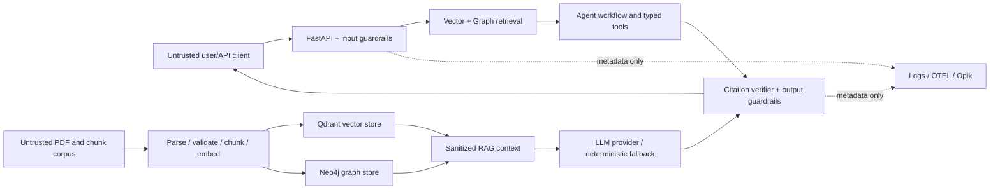

# Day 50 — Safety Threat Model

## Scope and methodology

This model covers the FastAPI `/research` path, Vector RAG/Qdrant, GraphRAG/
Neo4j, agents and typed tools, LLM provider gateway/fallback, PDF ingestion,
CI/CD, Cloud Run, logs, OpenTelemetry, and Opik. It is based on the current
repository implementation, not on an assumed production deployment. Cloud Run
and managed database activation remain documented as blocked until real
environment evidence exists.

The register uses likelihood and impact as `Low`, `Medium`, or `High`.
Residual risk is acceptable only with the listed operational condition. The
mapping uses [OWASP LLM Top 10 2025](https://genai.owasp.org/llm-top-10/) and
[MITRE ATLAS](https://atlas.mitre.org/). ATLAS labels are technique names; they
are not claims of observed attacker activity.

## Architecture trust boundaries

Primary boundaries are: client-to-API, externally acquired PDF-to-corpus,
corpus-to-retrieval context, LLM-to-tool/output handling, and runtime-to-cloud
or telemetry providers.

## Threat register

| ID | Threat and attack scenario | Affected components | Likelihood / impact | Current controls | Gaps and required test | Residual risk | OWASP / ATLAS |
|---|---|---|---|---|---|---|---|
| TM-01 | A client asks the model to ignore instructions, reveal its prompt, or alter tool behavior. | FastAPI, workflow, LLM gateway | M / H | Bounded request/history, explicit injection patterns, API key option, safe output checks. | Add multilingual/adversarial regression corpus and monitor block rate. Test direct injection variants at API boundary. | Medium: novel phrasing may evade deterministic patterns; no authority is delegated solely to prompt text. | LLM01; `LLM Prompt Injection`, `Prompt Infiltration via Public-Facing Application` |
| TM-02 | An issuer-hosted PDF or a poisoned chunk contains hidden/visible instructions intended to override the model. | Parser, chunking, Qdrant, GraphRAG, LLM context | M / H | Official-source collection, PDF identity/year checks, provenance, context size limits, and Day 52 detection/context isolation that excludes suspicious chunks. | Add OCR/image-hidden instruction detection and a quarantine/review workflow for suspicious documents. Test injected PDF text through both builders. | Medium: semantic or obfuscated instructions can survive pattern matching; accepted sources remain untrusted data. | LLM01, LLM04, LLM08; `Retrieval Content Crafting`, `RAG Poisoning`, `False RAG Entry Injection` |
| TM-03 | An attacker gets a crafted document embedded, making it rank highly and bias answers or citations. | Download/validation, chunks, embeddings, Qdrant, hybrid fusion | M / H | Filename/content validation, file hashes, deterministic chunk IDs, source metadata, filters, reranking, citation verification. | Require signed ingestion manifest, per-source approval, collection write identity separation, and retrieval-poison regression set. Test rank/citation resistance. | Medium: trusted upstream publisher compromise and semantic poisoning remain possible. | LLM04, LLM08; `RAG Poisoning`, `Poison Training Data`, `Erode Dataset Integrity` |
| TM-04 | A prompt, exception, trace, model output, or artifact discloses credentials, connection strings, or internal configuration. | API, LLM, logs, OTEL/Opik, CI artifacts | M / H | Recursive log redaction, metadata-only Opik, prompt/content exclusion, output secret redaction, Secret Manager injection, Gitleaks/Trivy. | Expand redaction regression corpus for provider-specific formats; verify cloud telemetry/artifacts after deployment. Test secret values never appear in logs/traces. | Low–Medium: operational misconfiguration or a new secret format can bypass regex controls. | LLM02, LLM07; `LLM Data Leakage`, `RAG Credential Harvesting`, `Extract LLM System Prompt` |
| TM-05 | A broad or malformed query returns another company's evidence, then it is attributed to the requested company. | Query transformer, Qdrant filters, graph retrieval, writer | M / H | Explicit ticker/year/company filters, source metadata, provenance fields, verifier company/year checks, citations. | Enforce caller intent filter consistency when an explicit company is requested; add tenant isolation before multi-tenant use. Test same-metric cross-company collision. | Medium: comparison questions intentionally retrieve multiple companies and require clear answer attribution. | LLM08, LLM09; `RAG Poisoning` (integrity analogue), `Data from Information Repositories` |
| TM-06 | The model invents source numbers or states a definitive financial metric without supporting evidence. | RAG/GraphRAG generation, writer, API response | M / H | Grounded prompts, citation checker/verifier, source-number validation, Day 51 invalid-citation redaction and uncited-financial-claim block. | Add semantic claim-to-evidence entailment evaluation and production citation-correctness SLO. Test fabricated but in-range citations. | Low–Medium: valid citation syntax does not itself prove semantic support. | LLM09, LLM05; `LLM Trusted Output Components Manipulation` |
| TM-07 | A compromised plan or injection attempts raw Cypher mutation, direct DB access, or a tool outside the agent role. | Agent contracts, tool adapters, Neo4j | L / H | Tool allowlists, typed adapters, read-only Cypher validator, Cypher labels/relations allowlists, Cloud Run service identity. | Invoke allowlist enforcement at every tool dispatcher boundary; deploy separate read-only DB credentials. Test every forbidden tool/mutation path. | Low: current tools are retrieval-focused, but future tool additions can expand agency. | LLM06; `AI Agent Tool Invocation`, `Data Destruction via AI Agent Tool Invocation`, `AI Agent Tool Poisoning` |
| TM-08 | Long requests, retrieval fan-out, retries, or expensive LLM calls exhaust tokens, API spend, CPU, or DB capacity. | API, workflow, retrievers, LLM providers, Cloud Run | H / H | Request/rate/concurrency limits, history/token/repetition guardrails, workflow token/model-call budgets, 300s timeout, max one Cloud Run instance. | Configure and enforce provider-priced monetary budget; add per-principal quotas and circuit-breaker load test. Test repeated retry/fan-out and cost-cap breach. | Medium: distributed callers and provider-side price changes can increase cost before detection. | LLM10; `Denial of AI Service`, `Cost Harvesting`, `Spamming AI System with Chaff Data` |
| TM-09 | User text, chunks, authorization headers, or errors are sent to logs/telemetry or retained in checkpoints/artifacts. | Structlog, OTEL, Opik, checkpoints, CI artifacts | M / H | Key/value redaction, metadata-only Opik, telemetry default off, prompt capture default false, run manifest allowlist. | Add structured log allowlist, artifact scanning gate, retention/deletion policy, and encrypt durable checkpoints at rest. Test no raw query/chunk in exporter payload. | Medium: application code may add new logging fields; local checkpoint storage is not multi-instance durable. | LLM02; `LLM Data Leakage`, `Data from AI Services`, `Exfiltration via AI Inference API` |
| TM-10 | A vulnerable dependency, unsigned image, permissive deployment, or compromised CI action changes runtime behavior or exfiltrates data. | uv dependencies, Docker, GitHub Actions, GHCR, Cloud Run | M / H | Lockfile/frozen install, SHA-pinned actions, non-root image, Trivy/Gitleaks/SBOM, digest deployment, Cosign release workflow, WIF/private Cloud Run. | Enforce HIGH severity release gate/SBOM attestation policy, dependabot review SLA, runtime admission verification, and production environment approvals. Test image signature verification and misconfiguration failure. | Medium: scanners do not detect every zero-day or trusted upstream compromise. | LLM03; `AI Supply Chain Compromise`, `Publish Poisoned Models`, `Modify AI Agent Configuration` |

## Risk treatment priorities

1. Keep untrusted-document isolation and citation verification as release gates.
2. Before any public or multi-tenant deployment, add identity-aware authorization,
   collection/database separation, encrypted durable checkpoints, and a monetary
   LLM budget.
3. Make telemetry/artifact leak scans and signed-image verification deployment
   prerequisites rather than documentation-only checks.
4. Treat retrieval quality/poisoning and citation correctness as monitored
   integrity controls, not one-time unit tests.

The machine-readable source of record is
`artifacts/safety/day50/threat_register.json`; normative implementation
requirements are in `security_requirements.md`.
