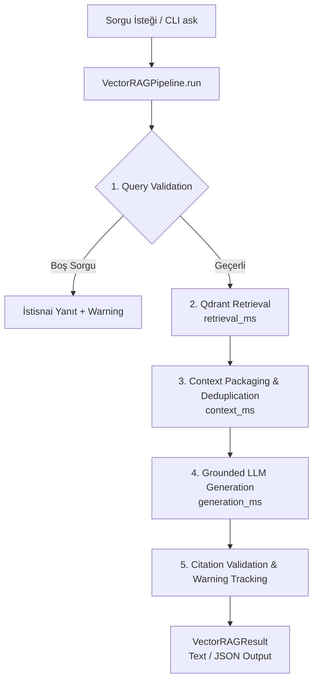

# 🚀 End-to-End Vector RAG Pipeline & Orchestration Documentation

## 🎯 Architectural Overview

Company Intelligence GraphRAG projesinin 14. Günü kapsamında geliştirilen **`VectorRAGPipeline`**, `VectorRetriever` (Gün 11), `ContextBuilder` (Gün 12) ve `RAGGenerator` (Gün 13) modüllerini tek bir orkestratör çatı altında birleştiren uçtan uca Vector RAG boru hattıdır.



---

## ⚙️ Boru Hattı Parametreleri ve Metrik Yapısı

### Metot Signature
```python
def run(
    self,
    query: str | SearchQuery,
    top_k: int = 5,
    score_threshold: float | None = None,
    max_context_chars: int = 4000,
    company: str | None = None,
    ticker: str | list[str] | None = None,
    year: int | list[int] | None = None,
    report_type: str | None = None,
) -> VectorRAGResult:
```

### `VectorRAGResult` Veri Modeli
- `query`: Orijinal kullanıcı sorgusu.
- `answer`: Üretilen kanıtlı cevap.
- `citations`: Doğrulanmış kaynak numaraları listesi (`[1, 2]`).
- `sources`: Kullanılan kaynakların metadata detayları.
- `retrieved_count`: Qdrant'tan çekilen toplam chunk sayısı.
- `used_source_count`: Cevapta atıfta bulunulan aktif kaynak sayısı.
- `insufficient_context`: Yetersiz bağlam durumu (`True/False`).
- `execution_time_ms`: Toplam çalışma süresi (milisaniye).
- `stage_timings_ms`: Aşama süre kırılımları (`retrieval_ms`, `context_ms`, `generation_ms`, `total_ms`).
- `warnings`: Çalışma esnasında oluşan uyarılar listesi (örn: mükerrer temizliği, bütçe aşımı veya geçersiz kaynak etiketleri).

---

## 💻 CLI Kullanım Örnekleri

### 1. Standart Metin Çıktılı Sorgulama
```bash
uv run company-graphrag ask \
  "ASELSAN'ın 2024 gelir ve kârlılık performansı nasıldı?" \
  --ticker ASELS \
  --year 2024 \
  --top-k 8
```

### 2. Yapılandırılmış JSON Çıktılı Sorgulama
```bash
uv run company-graphrag ask "Akbank 2024 müşteri sayısı" --ticker AKBNK --output json
```

---

## 📊 Örnek JSON Çıktısı

```json
{
  "query": "ASELSAN'ın 2024 gelir ve kârlılık performansı nasıldı?",
  "answer": "Aselsan Elektronik Sanayi ve Ticaret A.Ş. (ASELS) 2024 yılı raporu verilerine göre; Cirosu %13 büyüyerek 120 Milyar TL’ye ulaşmıştır. [Source 1]",
  "citations": [1],
  "sources": [
    {
      "source_number": 1,
      "chunk_id": "7b5a22a376740854",
      "company": "Aselsan Elektronik Sanayi ve Ticaret A.Ş.",
      "ticker": "ASELS",
      "year": 2024,
      "report_type": "annual_report",
      "page_number": 19,
      "source_file": "ASELS__2024__annual_report__tr.pdf",
      "text": "Başlıca Göstergeler ASELSAN’ın 2024 yılında Cirosu bir önceki yıla göre %13 büyüyerek 120 Milyar TL’ye ulaşmıştır...",
      "retrieval_score": 0.7452,
      "character_count": 280
    }
  ],
  "retrieved_count": 8,
  "used_source_count": 1,
  "insufficient_context": false,
  "execution_time_ms": 1150.4,
  "stage_timings_ms": {
    "retrieval_ms": 25.1,
    "context_ms": 1.5,
    "generation_ms": 1120.2,
    "total_ms": 1150.4
  },
  "warnings": []
}
```
