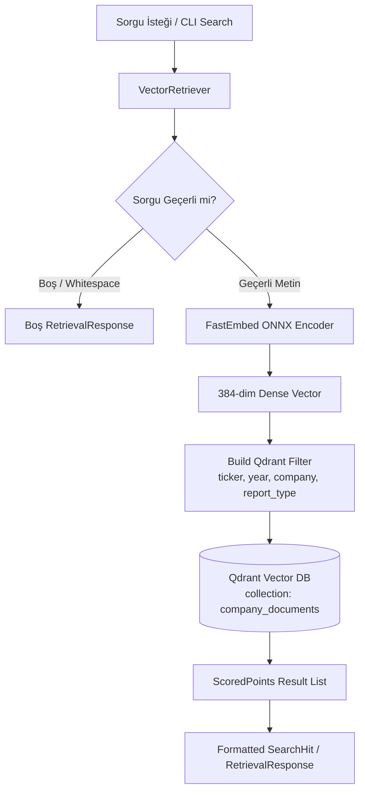

# 🔍 Vector RAG Retriever Pipeline Documentation

## 🎯 Architectural Overview

Company Intelligence GraphRAG projesinin 11. Günü kapsamında geliştirilen **`VectorRetriever`**, Qdrant vektör veritabanı üzerindeki **25.859 chunk** arasında yüksek performanslı ve metadata filtreli anlamsal arama (semantic search) hizmeti sunan üretim seviyesinde bir retrieval sınıfıdır.



---

## ⚙️ Sınıf ve Parametre Detayları

### `VectorRetriever` Sınıfı
Modül Yolu: `src/company_graphrag/retrieval/vector_retriever.py`

#### Metot: `retrieve(...)`
```python
def retrieve(
    self,
    query: str | SearchQuery,
    top_k: int = 5,
    ticker: str | list[str] | None = None,
    year: int | list[int] | None = None,
    company: str | None = None,
    report_type: str | None = None,
    score_threshold: float | None = None,
) -> SearchResponse:
```

#### Desteklenen Filtre Parametreleri:
- **`query`**: Doğal dil finansal arama sorgusu (örn: `"ASELSAN 2024 gelir performansı"`).
- **`top_k`**: Döndürülecek maksimum eşleşme sayısı (Varsayılan: `5`).
- **`score_threshold`**: Minimum kosinüs benzerlik skoru barajı (örn: `0.65`).
- **`company`**: Şirket ticari unvanına göre kesin eşleşme filtresi.
- **`ticker`**: BIST borsa koduna göre filtre (`ASELS`, `AKBNK` veya `["AKBNK", "SISE"]`).
- **`year`**: Rapor yılına göre filtre (`2024`, `2025` veya `[2023, 2024]`).
- **`report_type`**: Doküman türüne göre filtre (`annual_report`).

#### Dönen Her Sonuçtaki Zorunlu Alanlar:
- `chunk_id` (Benzersiz chunk kimliği)
- `text` (Metin içeriği parçası)
- `score` (Kosinüs benzerlik skoru)
- `company` (Şirket adı)
- `ticker` (Şirket borsa kodu)
- `year` (Rapor yılı)
- `report_type` (Doküman türü)
- `page_number` (Sayfa numarası)
- `source_file` (Kaynak PDF dosya adı)

---

## 💻 CLI Kullanım Örnekleri

### 1. Temel Anlamsal Arama
```bash
uv run company-graphrag search "ASELSAN'ın 2024 gelir performansı nedir?" --top-k 5
```

### 2. Filtreli Sorgulama (Ticker ve Yıl)
```bash
uv run company-graphrag search "yatırımlar" --ticker ASELS --year 2024
```

### 3. Şirket ve Rapor Türü Filtreli Sorgulama
```bash
uv run company-graphrag search "dijital bankacılık büyümesi" --company "Akbank T.A.Ş." --report-type annual_report
```

---

## 🛡️ Kenar Durumlar ve Güvenlik Yönetimi (Edge Cases)

1. **Boş / Whitespace Sorgular:** Hata fırlatmaz, anında `0` hit içeren `SearchResponse` döndürür.
2. **Bağlantı ve Model Hataları:** `try-except` blokları ile yakalanır, loglanır ve güvenli boş yanıt üretir.
3. **Eşleşmeyen Filtreler / Sonuç Bulunamaması:** `total_hits = 0` şeklinde güvenli yanıt basar.
4. **Veritabanı Dosya Kilidi Salınımı:** `close()` metodu ile Qdrant yerel motor kilitleri güvenle serbest bırakılır.
